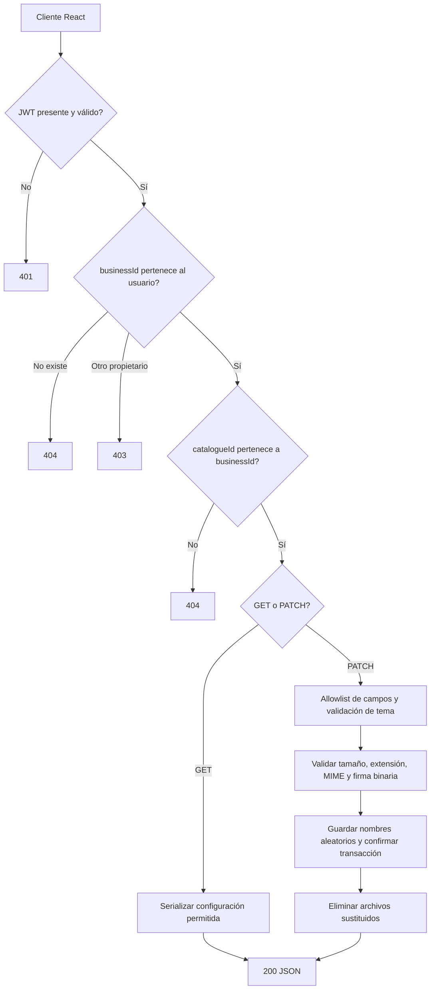
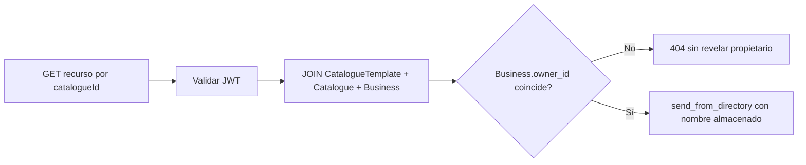
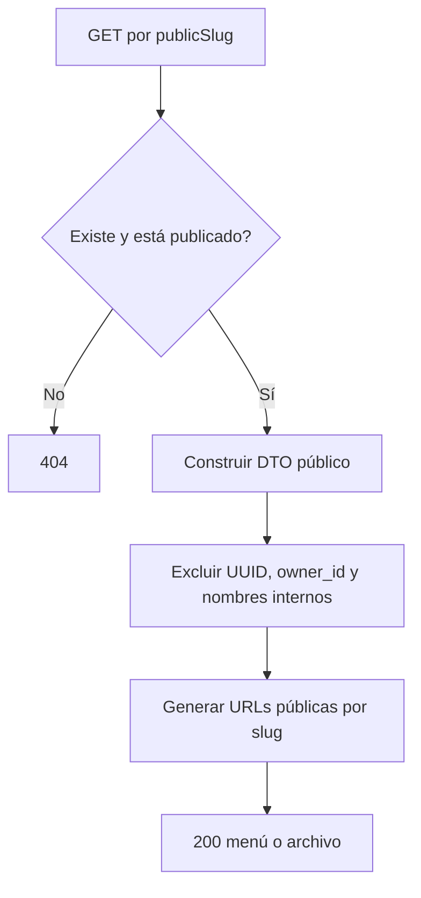
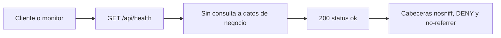

# ENIU: plantillas, fondos y auditoría de seguridad

Fecha: 13 de agosto de 2026  
Alcance: backend Flask, API privada/pública, personalización de plantillas y frontend React relacionado.

## Resumen ejecutivo

Se incorporaron cinco plantillas (`bistro`, `bold`, `natural`, `retro` y `luxury`), para un total de ocho. El modelo de configuración ahora guarda una imagen de fondo independiente de la portada y una opacidad entre `0` y `1`. La portada conserva su comportamiento y el fondo se muestra detrás del contenido en las ocho plantillas.

La revisión de seguridad combinó lectura del código y pruebas automatizadas controladas. Se cerraron dos exposiciones en los recursos privados de portada/fondo y se reforzó la validación de archivos. Las pruebas de inyección SQL, manipulación de UUID/URL, JWT alterados, CORS y solicitudes repetidas pasaron. La prueba repetida no equivale a una certificación contra DDoS ni a una prueba de carga de producción.

## Cambios funcionales

- Nuevas plantillas visuales: Bistró, Impactante, Natural, Retro y Lujo.
- `CatalogueTemplate.background_filename`: nombre interno del fondo.
- `CatalogueTemplate.background_opacity`: valor entre 0 y 1, con valor inicial `0.2`.
- Carga, reemplazo y eliminación de portada y fondo de forma independiente.
- Selector de opacidad de 0% a 100% en el frontend.
- Vista previa inmediata mediante URL temporal y persistencia mediante `multipart/form-data`.
- Fondo disponible en el menú público solamente cuando el catálogo está publicado.
- `GET /api/health` con respuesta mínima para monitoreo.

## Flujos de endpoints

### Consultar o modificar una plantilla privada



Endpoints:

- `GET /api/businesses/:businessId/catalogues/:catalogueId/template`
- `PATCH /api/businesses/:businessId/catalogues/:catalogueId/template`

### Obtener portada o fondo durante la administración



Endpoints privados:

- `GET /api/catalogues/:catalogueId/cover`
- `GET /api/catalogues/:catalogueId/background`

### Consultar un menú publicado y sus recursos



Endpoints públicos relacionados:

- `GET /api/public/menus/:publicSlug`
- `GET /api/public/menus/:publicSlug/cover`
- `GET /api/public/menus/:publicSlug/background`
- `GET /api/public/menus/:publicSlug/product-images/:sectionIndex/:productIndex`

### Salud y prueba repetida controlada



La prueba automatizada realizó 250 solicitudes secuenciales al endpoint de salud y 100 solicitudes privadas autenticadas. Todas devolvieron `200` dentro del límite local de 10 segundos fijado por la prueba.

## Auditorías realizadas

| Control | Método | Resultado |
|---|---|---|
| Inyección SQL | Payloads de tautología, `UNION` y `DROP TABLE` contra login, slug y creación | Aprobado: se trataron como datos; las tablas permanecieron intactas |
| SQL estático | Revisión de consultas y llamadas `execute` | Aprobado: ORM o sentencias SQLAlchemy parametrizadas; no se encontró SQL concatenado con entrada del usuario |
| Manipulación de URL/IDOR | Cruce de `businessId`, `catalogueId` y propietario; UUID inválidos; path traversal codificado | Aprobado en rutas privadas: `403/404`, sin datos de otro tenant |
| JWT | Ausente, texto inválido, firma alterada y token de otro usuario | Aprobado: `401/403` según el caso |
| Campos no permitidos | Métodos no aceptados y `custom_css` no autorizado | Aprobado: `405/400` |
| Archivos | Extensión, MIME, firma mágica y límite de 5 MB | Aprobado; un contenido ejecutable renombrado como JPG fue rechazado |
| Publicación | Fondo en borrador, publicado y despublicado | Aprobado: solamente se sirve con slug publicado |
| CORS | `Origin: https://evil.example` | Aprobado: no recibe `Access-Control-Allow-Origin` |
| Cabeceras | Respuestas API | Aprobado: `nosniff`, `DENY`, `no-referrer` y política de permisos |
| Solicitudes repetidas | 350 solicitudes secuenciales controladas con cliente Flask | Estabilidad local aprobada; no es prueba de concurrencia ni DDoS |
| Errores internos | Fallos SQL simulados | Aprobado: rollback y mensaje genérico al cliente |

## Hallazgos y tratamiento

### Corregidos

1. **Acceso directo a portada privada por UUID (medio).** La ruta administrativa no exigía JWT. Ahora exige autenticación y comprueba el propietario mediante la relación Business→Catalogue→Template. La ruta pública sigue separada y exige un slug publicado.
2. **Suplantación de tipo de archivo (medio).** Portadas, fondos, fotos de productos y fotos de negocio confiaban en extensión/MIME. Ahora también se verifica la firma binaria de PNG, JPEG o WebP; negocio, producto y plantilla tienen límite individual de 5 MB.
3. **Cabeceras defensivas ausentes (bajo).** Se agregaron cabeceras contra MIME sniffing, framing y filtración de referrer, además de `no-store` para autenticación.

### Pendientes recomendados

1. **Rate limiting distribuido (medio).** La aplicación no tiene Redis, limitador compartido ni control equivalente en gateway. Debe aplicarse por IP y por identidad, especialmente a login, recuperación, analíticas públicas y cargas de archivos. Un contador en memoria no es apropiado para varios workers.
2. **Rutas heredadas de archivos por identificador (medio).** `GET /api/products/:productId/images/:filename` y `GET /api/businesses/:businessId/photo` continúan públicas por compatibilidad del frontend. Los nombres de producto son aleatorios y se comprueban contra metadatos, pero conviene migrar la administración a rutas privadas con JWT y servir la parte pública exclusivamente mediante el `publicSlug` ya existente. La foto del negocio requiere una decisión explícita de visibilidad.
3. **Decodificación completa/antimalware (bajo).** La firma binaria evita el spoofing simple, pero no sustituye decodificar y re-encodear la imagen ni un escáner antimalware para una operación de mayor riesgo.
4. **Prueba de carga de producción (medio).** Falta medir concurrencia real mediante el servidor WSGI, PostgreSQL y el proxy de producción, con límites y autorización explícitos. No se ejecutó una prueba destructiva o de denegación de servicio.
5. **CORS de producción (bajo).** La lista actual permite solamente los orígenes locales. Antes del despliegue debe incluirse el dominio exacto de producción mediante configuración, nunca con `*` para rutas autenticadas.

## Migración

Revisión Alembic: `3774ab2fbbed`, sucesora de `0161decd8ffb`.

```text
catalogue_template.background_filename VARCHAR(255) NULL
catalogue_template.background_opacity FLOAT NOT NULL DEFAULT 0.2
```

La migración se aplicó sobre PostgreSQL y `flask db check` informó que no existen nuevas operaciones pendientes.

## Verificación

- Backend: `python -m unittest discover -s tests -v`: **61 pruebas aprobadas**.
- Frontend: `npm test`: **41 pruebas aprobadas en 11 archivos**.
- Calidad: `npm run lint`.
- Producción: `npm run build`.
- Base de datos: `flask db upgrade`, `flask db current` y `flask db check`.

Advertencias no bloqueantes: ESLint conserva una advertencia previa de React Hook Form en `RegisterForm.jsx`; Vite advierte que el chunk principal supera 500 kB. No hubo errores de lint ni de compilación.

## Límites de esta auditoría

Esta revisión es una auditoría técnica de código y pruebas locales, no una certificación de seguridad. No incluyó infraestructura de nube, TLS, secretos desplegados, WAF, dependencias mediante un SCA externo, contenedores, sistema operativo ni pentest sobre un entorno público.
